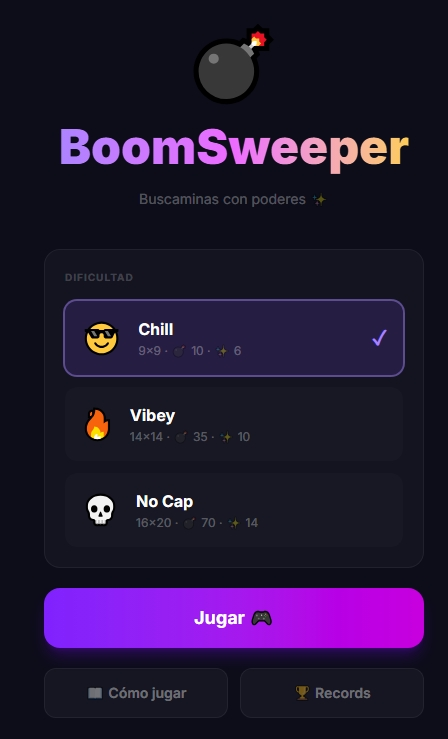

# 💣 [BoomSweeper](https://coiponorte.github.io/BoomSweeper/)

Buscaminas con poderes especiales para la generación Z. Construido con React + Vite + Tailwind CSS.

## 🎮 Jugar

**[▶ Jugar ahora](https://coiponorte.github.io/BoomSweeper/)**

## ✨ Características

- 🛡️ **Casillas especiales** — Escudo, Visión, Freeze, X-Ray, Suerte, Doble puntos
- 📱 **Responsivo** — Funciona en móvil y escritorio
- 🔊 **Efectos de sonido** — Web Audio API
- 💥 **Juicy feedback** — Screen shake, partículas, animaciones
- 💾 **Persistencia** — High scores guardados en IndexedDB
- 🚀 **Single file** — Todo el juego en un solo HTML

## 🎮 Controles

| Plataforma | Revelar casilla | Poner bandera 🚩 |
|------------|----------------|-------------------|
| 📱 Móvil   | Tap            | Mantener presionado |
| 🖥️ Desktop | Click          | Click derecho      |

**Atajos de teclado:**
- `ESC` — Pausar / Reanudar
- `R` — Reiniciar (en game over)
- `F` — Alternar modo bandera

## 🛠️ Stack

- **React 19** — UI
- **Vite 7** — Build
- **Tailwind CSS 4** — Estilos
- **TypeScript** — Tipos
- **IndexedDB** — Persistencia local
- **Web Audio API** — Sonidos
- **vite-plugin-singlefile** — Bundle en un solo HTML

## 📄 Licencia

MIT
